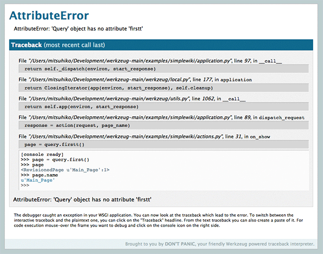

======================
Debugging Applications
======================

.. module:: werkzeug.debug

Depending on the WSGI gateway/server, exceptions are handled differently.
But most of the time, exceptions go to stderr or the error log.

Since this is not the best debugging environment, Werkzeug provides a
WSGI middleware that renders nice debugging tracebacks, optionally with an
AJAX based debugger (which allows to execute code in the context of the
traceback's frames).

The interactive debugger however does not work in forking environments
which makes it nearly impossible to use on production servers.  Also the
debugger allows the execution of arbitrary code which makes it a major
security risk and **must never be used on production machines** because of
that.

Enabling the Debugger
=====================

You can enable the debugger by wrapping the application in a
:class:`DebuggedApplication` middleware.  Additionally there are
parameters to the :func:`run_simple` function to enable it because this
is a common task during development.

.. autoclass:: DebuggedApplication

Using the Debugger
==================

Once enabled and an error happens during a request you will see a detailed
traceback instead of a general "internal server error".  If you have the
`evalex` feature enabled you can also get a traceback for every frame in
the traceback by clicking on the console icon.

Once clicked a console opens where you can execute Python code in:

Inside the interactive consoles you can execute any kind of Python code.
Unlike regular Python consoles the output of the object reprs is colored
and stripped to a reasonable size by default.  If the output is longer
than what the console decides to display a small plus sign is added to
the repr and a click will expand the repr.

To display all variables that are defined in the current frame you can
use the `dump()` function.  You can call it without arguments to get a
detailed list of all variables and their values, or with an object as
argument to get a detailed list of all the attributes it has.

Pasting Errors
==============

If you click on the `Traceback` title the traceback switches over to a text
based one.  The text based one can be pasted to `paste.pocoo.org`_ with one
click.

.. _paste.pocoo.org: http://paste.pocoo.org/
