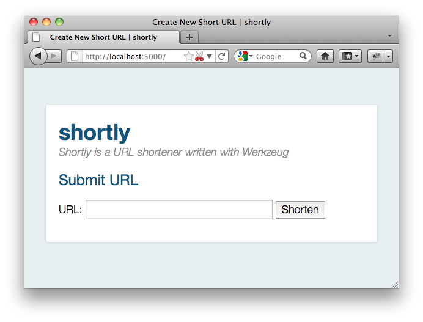

=================
Werkzeug Tutorial
=================

.. currentmodule:: werkzeug

Welcome to the Werkzeug tutorial in which we will create a `TinyURL`_ clone
that stores URLs in a redis instance.  The libraries we will use for this
applications are `Jinja`_ 2 for the templates, `redis`_ for the database
layer and, of course, Werkzeug for the WSGI layer.

You can use `pip` to install the required libraries::

    pip install Jinja2 redis Werkzeug

Also make sure to have a redis server running on your local machine.  If
you are on OS X, you can use `brew` to install it::

    brew install redis

If you are on Ubuntu or Debian, you can use apt-get::

    sudo apt-get install redis-server

Redis was developed for UNIX systems and was never really designed to
work on Windows.  For development purposes, the unofficial ports however
work well enough.  You can get them from `github
<https://github.com/dmajkic/redis/downloads>`_.

Introducing Shortly
-------------------

In this tutorial, we will together create a simple URL shortener service
with Werkzeug.  Please keep in mind that Werkzeug is not a framework, it's
a library with utilities to create your own framework or application and
as such is very flexible.  The approach we use here is just one of many you
can use.

As data store, we will use `redis`_ here instead of a relational database
to keep this simple and because that's the kind of job that `redis`_
excels at.

The final result will look something like this:

.. _TinyURL: https://tinyurl.com/
.. _Jinja: http://jinja.pocoo.org/
.. _redis: https://redis.io/

Step 0: A Basic WSGI Introduction
---------------------------------

Werkzeug is a utility library for WSGI.  WSGI itself is a protocol or
convention that ensures that your web application can speak with the
webserver and more importantly that web applications work nicely together.

A basic “Hello World” application in WSGI without the help of Werkzeug
looks like this::

    def application(environ, start_response):
        start_response('200 OK', [('Content-Type', 'text/plain')])
        return ['Hello World!']

A WSGI application is something you can call and pass an environ dict
and a ``start_response`` callable.  The environ contains all incoming
information, the ``start_response`` function can be used to indicate the
start of the response.  With Werkzeug you don't have to deal directly with
either as request and response objects are provided to work with them.

The request data takes the environ object and allows you to access the
data from that environ in a nice manner.  The response object is a WSGI
application in itself and provides a much nicer way to create responses.

Here is how you would write that application with response objects::

    from werkzeug.wrappers import Response

    def application(environ, start_response):
        response = Response('Hello World!', mimetype='text/plain')
        return response(environ, start_response)

And here an expanded version that looks at the query string in the URL
(more importantly at the `name` parameter in the URL to substitute “World”
against another word)::

    from werkzeug.wrappers import Request, Response

    def application(environ, start_response):
        request = Request(environ)
        text = f"Hello {request.args.get('name', 'World')}!"
        response = Response(text, mimetype='text/plain')
        return response(environ, start_response)

And that's all you need to know about WSGI.

Step 1: Creating the Folders
----------------------------

Before we get started, let’s create the folders needed for this application::

    /shortly
        /static
        /templates

The shortly folder is not a python package, but just something where we
drop our files.  Directly into this folder we will then put our main
module in the following steps. The files inside the static folder are
available to users of the application via HTTP.  This is the place where
CSS and JavaScript files go. Inside the templates folder we will make
Jinja2 look for templates.  The templates you create later in the tutorial
will go in this directory.

Step 2: The Base Structure
--------------------------

Now let's get right into it and create a module for our application.  Let's
create a file called `shortly.py` in the `shortly` folder.  At first we
will need a bunch of imports.  I will pull in all the imports here, even
if they are not used right away, to keep it from being confusing::

    import os
    import redis
    from werkzeug.urls import url_parse
    from werkzeug.wrappers import Request, Response
    from werkzeug.routing import Map, Rule
    from werkzeug.exceptions import HTTPException, NotFound
    from werkzeug.middleware.shared_data import SharedDataMiddleware
    from werkzeug.utils import redirect
    from jinja2 import Environment, FileSystemLoader

Then we can create the basic structure for our application and a function
to create a new instance of it, optionally with a piece of WSGI middleware
that exports all the files on the `static` folder on the web::

    class Shortly(object):

        def __init__(self, config):
            self.redis = redis.Redis(config['redis_host'], config['redis_port'])

        def dispatch_request(self, request):
            return Response('Hello World!')

        def wsgi_app(self, environ, start_response):
            request = Request(environ)
            response = self.dispatch_request(request)
            return response(environ, start_response)

        def __call__(self, environ, start_response):
            return self.wsgi_app(environ, start_response)

    def create_app(redis_host='localhost', redis_port=6379, with_static=True):
        app = Shortly({
            'redis_host':       redis_host,
            'redis_port':       redis_port
        })
        if with_static:
            app.wsgi_app = SharedDataMiddleware(app.wsgi_app, {
                '/static':  os.path.join(os.path.dirname(__file__), 'static')
            })
        return app

Lastly we can add a piece of code that will start a local development
server with automatic code reloading and a debugger::

    if __name__ == '__main__':
        from werkzeug.serving import run_simple
        app = create_app()
        run_simple('127.0.0.1', 5000, app, use_debugger=True, use_reloader=True)

The basic idea here is that our ``Shortly`` class is an actual WSGI
application.  The ``__call__`` method directly dispatches to ``wsgi_app``.
This is done so that we can wrap ``wsgi_app`` to apply middlewares like we
do in the ``create_app`` function.  The actual ``wsgi_app`` method then
creates a :class:`Request` object and calls the ``dispatch_request``
method which then has to return a :class:`Response` object which is then
evaluated as WSGI application again.  As you can see: turtles all the way
down.  Both the ``Shortly`` class we create, as well as any request object
in Werkzeug implements the WSGI interface.  As a result of that you could
even return another WSGI application from the ``dispatch_request`` method.

The ``create_app`` factory function can be used to create a new instance
of our application.  Not only will it pass some parameters as
configuration to the application but also optionally add a WSGI middleware
that exports static files.  This way we have access to the files from the
static folder even when we are not configuring our server to provide them
which is very helpful for development.

Intermezzo: Running the Application
-----------------------------------

Now you should be able to execute the file with `python` and see a server
on your local machine::

    $ python shortly.py
     * Running on http://127.0.0.1:5000/
     * Restarting with reloader: stat() polling

It also tells you that the reloader is active.  It will use various
techniques to figure out if any file changed on the disk and then
automatically restart.

Just go to the URL and you should see “Hello World!”.

Step 3: The Environment
-----------------------

Now that we have the basic application class, we can make the constructor
do something useful and provide a few helpers on there that can come in
handy.  We will need to be able to render templates and connect to redis,
so let's extend the class a bit::

    def __init__(self, config):
        self.redis = redis.Redis(config['redis_host'], config['redis_port'])
        template_path = os.path.join(os.path.dirname(__file__), 'templates')
        self.jinja_env = Environment(loader=FileSystemLoader(template_path),
                                     autoescape=True)

    def render_template(self, template_name, **context):
        t = self.jinja_env.get_template(template_name)
        return Response(t.render(context), mimetype='text/html')

Step 4: The Routing
-------------------

Next up is routing.  Routing is the process of matching and parsing the URL to
something we can use.  Werkzeug provides a flexible integrated routing
system which we can use for that.  The way it works is that you create a
:class:`~werkzeug.routing.Map` instance and add a bunch of
:class:`~werkzeug.routing.Rule` objects.  Each rule has a pattern it will
try to match the URL against and an “endpoint”.  The endpoint is typically
a string and can be used to uniquely identify the URL.  We could also use
this to automatically reverse the URL, but that's not what we will do in this
tutorial.

Just put this into the constructor::

    self.url_map = Map([
        Rule('/', endpoint='new_url'),
        Rule('/<short_id>', endpoint='follow_short_link'),
        Rule('/<short_id>+', endpoint='short_link_details')
    ])

Here we create a URL map with three rules.  ``/`` for the root of the URL
space where we will just dispatch to a function that implements the logic
to create a new URL.  And then one that follows the short link to the
target URL and another one with the same rule but a plus (``+``) at the
end to show the link details.

So how do we find our way from the endpoint to a function?  That's up to you.
The way we will do it in this tutorial is by calling the method ``on_``
+ endpoint on the class itself.  Here is how this works::

    def dispatch_request(self, request):
        adapter = self.url_map.bind_to_environ(request.environ)
        try:
            endpoint, values = adapter.match()
            return getattr(self, f'on_{endpoint}')(request, **values)
        except HTTPException as e:
            return e

We bind the URL map to the current environment and get back a
:class:`~werkzeug.routing.URLAdapter`.  The adapter can be used to match
the request but also to reverse URLs.  The match method will return the
endpoint and a dictionary of values in the URL.  For instance the rule for
``follow_short_link`` has a variable part called ``short_id``.  When we go
to ``http://localhost:5000/foo`` we will get the following values back::

    endpoint = 'follow_short_link'
    values = {'short_id': 'foo'}

If it does not match anything, it will raise a
:exc:`~werkzeug.exceptions.NotFound` exception, which is an
:exc:`~werkzeug.exceptions.HTTPException`.  All HTTP exceptions are also
WSGI applications by themselves which render a default error page.  So we
just catch all of them down and return the error itself.

If all works well, we call the function ``on_`` + endpoint and pass it the
request as argument as well as all the URL arguments as keyword arguments
and return the response object that method returns.

Step 5: The First View
----------------------

Let's start with the first view: the one for new URLs::

    def on_new_url(self, request):
        error = None
        url = ''
        if request.method == 'POST':
            url = request.form['url']
            if not is_valid_url(url):
                error = 'Please enter a valid URL'
            else:
                short_id = self.insert_url(url)
                return redirect(f"/{short_id}+"

                )
        return self.render_template('new_url.html', error=error, url=url)

This logic should be easy to understand.  Basically we are checking that
the request method is POST, in which case we validate the URL and add a
new entry to the database, then redirect to the detail page.  This means
we need to write a function and a helper method.  For URL validation this
is good enough::

    def is_valid_url(url):
        parts = url_parse(url)
        return parts.scheme in ('http', 'https')

For inserting the URL, all we need is this little method on our class::

    def insert_url(self, url):
        short_id = self.redis.get(f'reverse-url:{url}')
        if short_id is not None:
            return short_id
        url_num = self.redis.incr('last-url-id')
        short_id = base36_encode(url_num)
        self.redis.set(f'url-target:{short_id}', url)
        self.redis.set(f'reverse-url:{url}', short_id)
        return short_id

``reverse-url:`` + the URL will store the short id.  If the URL was
already submitted this won't be None and we can just return that value
which will be the short ID.  Otherwise we increment the ``last-url-id``
key and convert it to base36.  Then we store the link and the reverse
entry in redis.  And here the function to convert to base 36::

    def base36_encode(number):
        assert number >= 0, 'positive integer required'
        if number == 0:
            return '0'
        base36 = []
        while number != 0:
            number, i = divmod(number, 36)
            base36.append('0123456789abcdefghijklmnopqrstuvwxyz'[i])
        return ''.join(reversed(base36))

So what is missing for this view to work is the template.  We will create
this later, let's first also write the other views and then do the
templates in one go.

Step 6: Redirect View
---------------------

The redirect view is easy.  All it has to do is to look for the link in
redis and redirect to it.  Additionally we will also increment a counter
so that we know how often a link was clicked::

    def on_follow_short_link(self, request, short_id):
        link_target = self.redis.get(f'url-target:{short_id')
        if link_target is None:
            raise NotFound()
        self.redis.incr(f'click-count:{short_id}')
        return redirect(link_target)

In this case we will raise a :exc:`~werkzeug.exceptions.NotFound` exception
by hand if the URL does not exist, which will bubble up to the
``dispatch_request`` function and be converted into a default 404
response.

Step 7: Detail View
-------------------

The link detail view is very similar, we just render a template
again.  In addition to looking up the target, we also ask redis for the
number of times the link was clicked and let it default to zero if such
a key does not yet exist::

    def on_short_link_details(self, request, short_id):
        link_target = self.redis.get(f'url-target:{short_id}')
        if link_target is None:
            raise NotFound()
        click_count = int(self.redis.get(f'click-count:{short_id}') or 0)
        return self.render_template('short_link_details.html',
            link_target=link_target,
            short_id=short_id,
            click_count=click_count
        )

Please be aware that redis always works with strings, so you have to convert
the click count to :class:`int` by hand.

Step 8: Templates
-----------------

And here are all the templates.  Just drop them into the `templates`
folder.  Jinja2 supports template inheritance, so the first thing we will
do is create a layout template with blocks that act as placeholders.  We
also set up Jinja2 so that it automatically escapes strings with HTML
rules, so we don't have to spend time on that ourselves.  This prevents
XSS attacks and rendering errors.

*layout.html*:

.. sourcecode:: html+jinja

    <!doctype html>
    <title> | shortly</title>
    <link rel=stylesheet href=/static/style.css type=text/css>
    

      <h1><a href=/>shortly</a></h1>
      
Shortly is a URL shortener written with Werkzeug
      
    

*new_url.html*:

.. sourcecode:: html+jinja

    
    Create New Short URL
    
      <h2>Submit URL</h2>
      <form action="" method=post>
        
          
<strong>Error:</strong> {{ error }}
        
        
URL:
          <input type=text name=url value="{{ url }}" class=urlinput>
          <input type=submit value="Shorten">
      </form>
    

*short_link_details.html*:

.. sourcecode:: html+jinja

    
    Details about /{{ short_id }}
    
      <h2><a href="/{{ short_id }}">/{{ short_id }}</a></h2>
      <dl>
        <dt>Full link
        <dd class=link>
{{ link_target }}

        <dt>Click count:
        <dd>{{ click_count }}
      </dl>
    

Step 9: The Style
-----------------

For this to look better than ugly black and white, here a simple
stylesheet that goes along:

*static/style.css*:

.. sourcecode:: css

    body        { background: #E8EFF0; margin: 0; padding: 0; }
    body, input { font-family: 'Helvetica Neue', Arial,
                  sans-serif; font-weight: 300; font-size: 18px; }
    .box        { width: 500px; margin: 60px auto; padding: 20px;
                  background: white; box-shadow: 0 1px 4px #BED1D4;
                  border-radius: 2px; }
    a           { color: #11557C; }
    h1, h2      { margin: 0; color: #11557C; }
    h1 a        { text-decoration: none; }
    h2          { font-weight: normal; font-size: 24px; }
    .tagline    { color: #888; font-style: italic; margin: 0 0 20px 0; }
    .link div   { overflow: auto; font-size: 0.8em; white-space: pre;
                  padding: 4px 10px; margin: 5px 0; background: #E5EAF1; }
    dt          { font-weight: normal; }
    .error      { background: #E8EFF0; padding: 3px 8px; color: #11557C;
                  font-size: 0.9em; border-radius: 2px; }
    .urlinput   { width: 300px; }

Bonus: Refinements
------------------

Look at the implementation in the example dictionary in the Werkzeug
repository to see a version of this tutorial with some small refinements
such as a custom 404 page.

-   `shortly in the example folder <https://github.com/pallets/werkzeug/tree/main/examples/shortly>`_
